# Buscador de Carros — OLX Scraper

Scraper de anúncios de carros da OLX + interface web para visualização com filtros.

## Funcionalidades

- Scraper de anúncios de carros da OLX (contorna Cloudflare)
- 25+ campos extraídos: preço, ano, km, combustível, câmbio, cor, tipo, motor, bairro, CEP, anunciante, fotos etc.
- Interface web com filtros por: marca, modelo, cidade, bairro, tipo, motor, câmbio, ano, preço, km
- Ordenação por: preço, ano, km, data
- Filtros com checkbox, selecionados aparecem primeiro
- Botão "Marcar todos" em cada filtro
- Página de configuração para definir URL de pesquisa e executar o scraper
- Imagens exibidas via proxy (contorna bloqueio de hotlinking)
- **Ignorar anúncios** — oculta anúncios da listagem e filtros; página dedicada para gerenciar e restaurar
- **Favoritar anúncios** — marca com ♥ para acesso rápido; página dedicada com todos os favoritos
- **Modelos compostos** — reconhece nomes de modelo com duas palavras (Grand Siena, C4 Lounge, etc.) via JSON editável pela interface web
- **Exportar/Importar banco** — backup completo (.zip) do banco, configurações e modelos compostos
- Ignora anúncios com palavras-chave no título (*, retirada de peça, entrada, parcelas, sucata)
- **Status dos anúncios:** novo/não novo/excluído — detectados automaticamente ao executar o scraper

## Stack

Python 3, Scrapy, Flask, SQLAlchemy, SQLite, Bootstrap 5, cloudscraper

## Pré-requisitos

- **Python 3.9+** instalado
- **pip** e **venv** (geralmente inclusos no Python)

  No Windows, marque "Add Python to PATH" durante a instalação.
  No Linux, instale com: `sudo apt install python3 python3-pip python3-venv`

## Como usar

### Linux / macOS

```bash
python3 -m venv .venv
.venv/bin/pip install -r requirements.txt
.venv/bin/python run_scraper.py    # baixa os anúncios
.venv/bin/python web/app.py        # inicia o servidor em http://localhost:5000
```

### Windows (PowerShell)

```powershell
python -m venv .venv
.venv\Scripts\pip install -r requirements.txt
.venv\Scripts\python run_scraper.py
.venv\Scripts\python web\app.py
```

Ou via interface web: `http://localhost:5000/config` — cole a URL de pesquisa da OLX e clique em "Salvar e Atualizar".

### Diferenças entre terminal e web

|                             | Terminal `run_scraper.py`                                                                                                                             | Web "Salvar e Atualizar"                                                                                                                              |
| --------------------------- | ----------------------------------------------------------------------------------------------------------------------------------------------------- | ----------------------------------------------------------------------------------------------------------------------------------------------------- |
| **Limpa o banco**           | ❌ Não — faz upsert (atualiza anúncios existentes, insere novos)                                                                                        | ✅ Sim — apaga tudo antes de baixar                                                                                                                     |
| **Salva cidades permitidas** | ❌ Não — usa o `cidades_permitidas.json` atual                                                                                                          | ✅ Salva o conteúdo do campo "Cidades permitidas" antes de iniciar                                                                                      |
| **Lê URL de**               | `.current_url` ou `config.py`                                                                                                                           | Formulário da página                                                                                                                                    |
| **Progresso**               | Terminal (texto)                                                                                                                                      | Barra na página web                                                                                                                                   |
| **Após finalizar**          | Prompt volta ao normal                                                                                                                                | Redireciona automaticamente para a listagem                                                                                                           |

Para rodar idêntico ao web pelo terminal:

```bash
.venv/bin/python clear_db.py && .venv/bin/python run_scraper.py
```

## Configuração

Em `config.py`:
- `START_URL` — URL da pesquisa na OLX
- `START_PAGE` — página inicial (1 = primeira página)

## Interface

### Listagem de anúncios

Tabela com foto, título, preço, ano, KM, cidade e ações (ignorar/favoritar). Barra lateral com filtros por marca, modelo, cidade, bairro, tipo, motor, câmbio e ano.

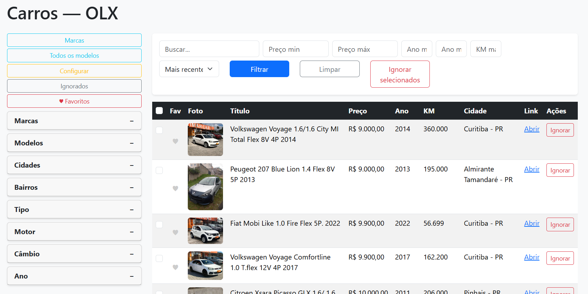

### Filtros

Filtros com checkbox, itens selecionados aparecem primeiro e botão "Marcar todos".

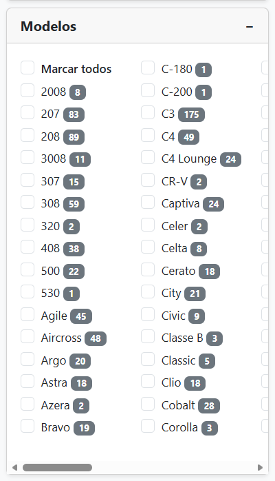

### Marcas

Lista de marcas disponíveis com contagem de anúncios.

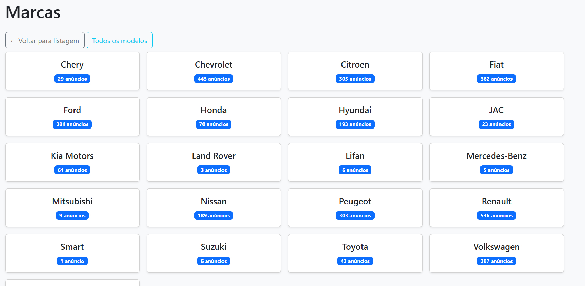

Modelos de uma marca específica.

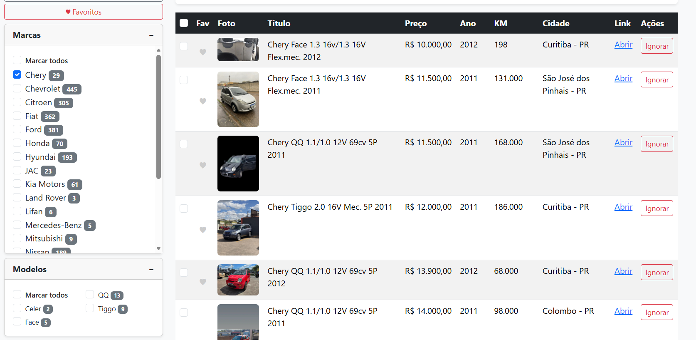

### Todos os modelos

Grid com todos os modelos agrupados por marca, com botão para copiar lista em texto puro.

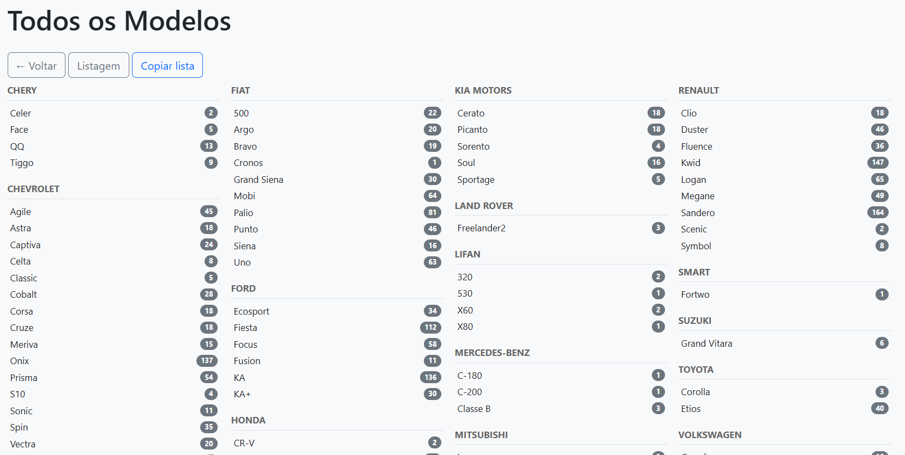
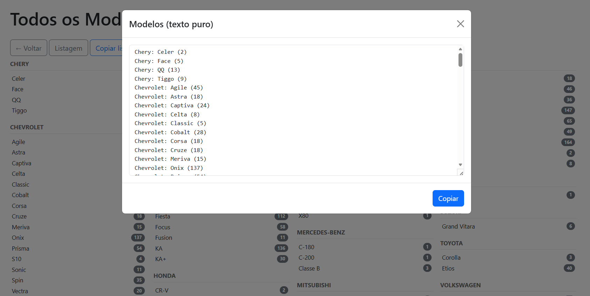

### Modelos compostos

Página para gerenciar modelos com nome composto (duas palavras). As alterações são salvas em `models_compostos.json` e lidas pelo scraper automaticamente.

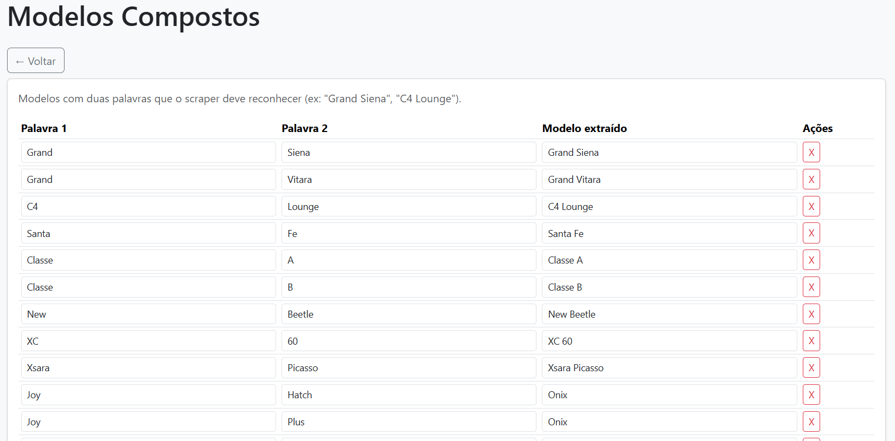

### Anúncios ignorados

Anúncios ignorados são ocultados da listagem e filtros, mas mantidos no banco. Podem ser restaurados pela página de ignorados.

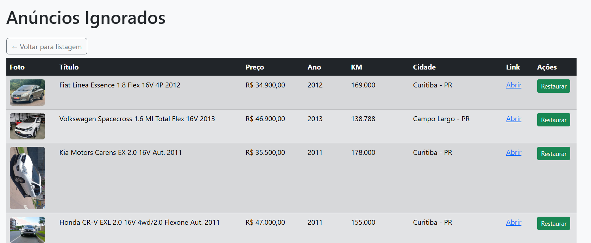

### Anúncios favoritos

Marque anúncios com ♥ para acesso rápido. Página dedicada lista apenas os favoritos.

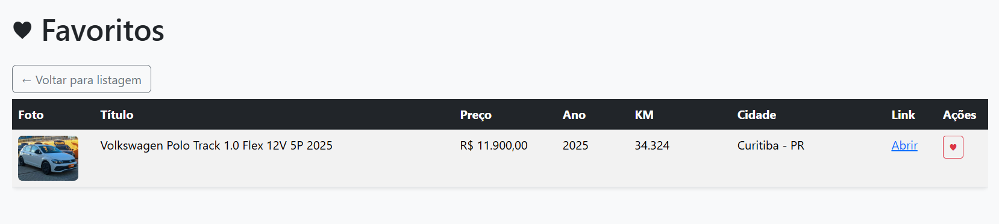

### Filtros salvos

Botão `+` na sidebar permite salvar o conjunto atual de filtros (marca, modelo, tipo, preço, etc.) com um nome. Os filtros ficam salvos no banco de dados e podem ser carregados pelo dropdown "Filtros salvos..." na sidebar.

### Status dos anúncios

O scraper detecta automaticamente o status de cada anúncio:

| Status       | Ícone                 | Critério                            | Onde aparece                              |
| ------------ | --------------------- | ----------------------------------- | ----------------------------------------- |
| **Novo**     | Badge verde "Novo"     | `created_at ≈ updated_at`             | Listagem com badge e linha destacada       |
| **Não novo** | Normal                | `created_at < updated_at`             | Listagem normalmente                       |
| **Excluído** | Badge vermelho "Excluído" | `status = 'deleted'` (não reencontrado no último scrape) | Oculto da listagem; visível em Favoritos |

O botão "Apenas novos" filtra a listagem para exibir somente os anúncios com badge verde.

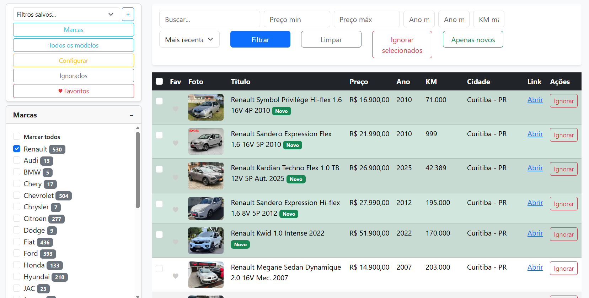

### Paginação

A listagem exibe 50 anúncios por página, com navegação numérica no rodapé. Filtros e ordenação são preservados ao navegar entre páginas.

### Filtro de cidades no scraper

No formulário de configuração é possível informar as cidades que devem ser baixadas (uma por linha). Se vazio, baixa anúncios de todas as cidades. O scraper salva no banco apenas anúncios das cidades informadas.

### Configuração

Página para definir URL de pesquisa, executar o scraper, gerenciar modelos compostos, exportar/importar banco de dados.

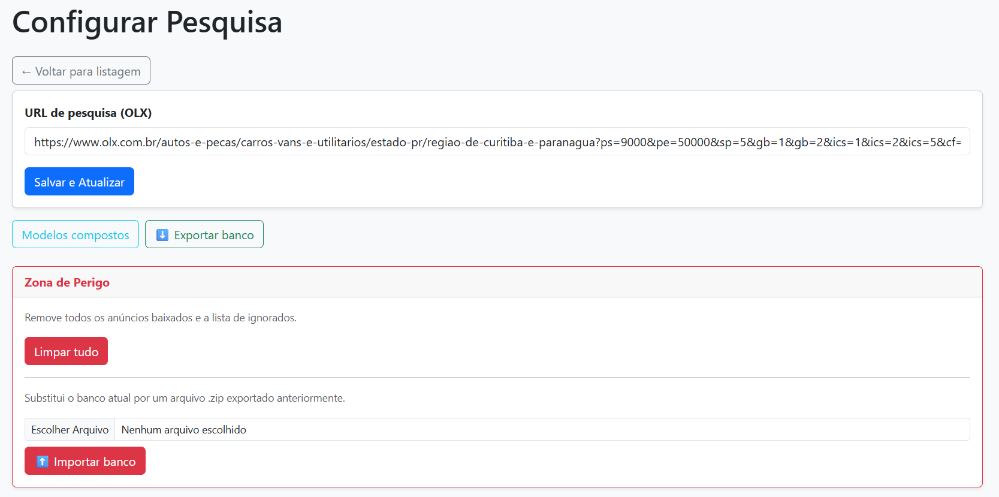
